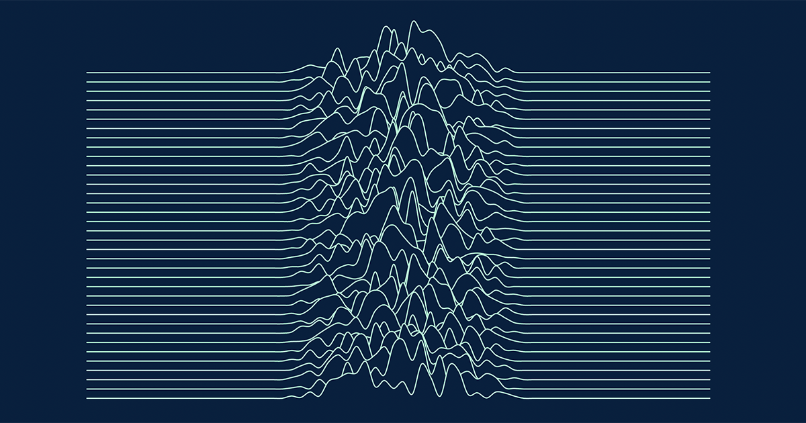

# Website


My personal website ✨ Check out the live version at [markspicer.me](https://markspicer.me) 👀



## Develop
First, install the dependencies:

```
npm i
```

Then run the development server:
```
npm run start
```

This will automatically open a browser window at [http://localhost:3000/](http://localhost:3000/)